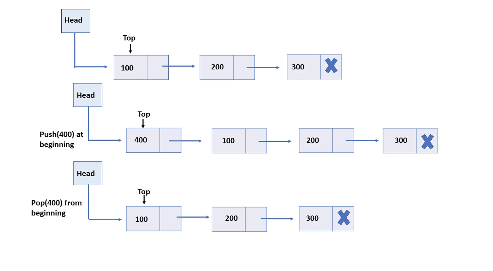
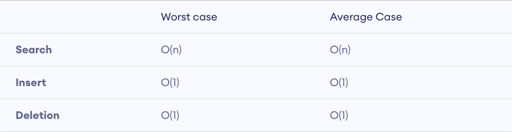

<div align="center">
    
    <h1>Data Structure and Algorithms</h1>
    <strong>A data structure is a storage that is used to store and organize data. It is a way of arranging data on a computer so that it can be accessed and updated efficiently.</strong>
</div>


Contents
----------------------------------

- [Data Structure and Algorithms](#data-structure-and-algorithms)
- [Definition](#definition)
- [Categories of Algorithms](#categories-of-algorithms)
- [Basic Operations of Algorithms](#basic-operations-of-algorithms)
- [Details of Algorithms](#details-of-algorithms)
    - [Arrays](#arrays)
    - [String](#string)
    - [Searching](#searching)
    - [Sorting](#sorting)
    - [Greedy Algorithm](#greedy-algorithm)
    - [Dynamic Programming](#dynamic-programming)
    - [Binary Search Trees](#binary-search-trees)
    - [Graph](#graph)
        - [History](#history)
        - [Definition](#definition-1)
        - [Types of Graphs](#types-of-graphs)
            - [Directed Graph](#directed-graph)
            - [Undirected Graph](#undirected-graph)
        - [Properties of Graph](#properties-of-graph)
        - [Graph Theory Algorithm](#graph-theory-algorithm)
        - [Trees, Degree and Cycle of Graph](#trees-degree-and-cycle-of-graph)
        - [References](#references)
    - [Heaps](#heaps)
    - [Recursion](#recursion)
        - [Properties of Recursion](#properties-of-recursion)
        - [Advantages](#advantages)
        - [Disadvantages](#disadvantages)
        - [Operations](#operations)
        - [References](#references-1)
    - [Stack](#stack)
        - [Definition](#definition-2)
        - [Types of Stack](#types-of-stack)
        - [Basic Operations](#basic-operations)
        - [Implementation of Stack](#implementation-of-stack)
            - [Array Implementations](#array-implementations)
            - [Linked List Implementation](#linked-list-implementation)
        - [Application of Stack](#application-of-stack)
        - [References](#references-2)
    - [Tries](#tries)
    - [Linked Lists](#linked-lists)
        - [Advantage](#advantage)
        - [Disadvantage](#disadvantage)
        - [Operations](#operations-1)
        - [References](#references-3)
        - [Time Complexity](#time-complexity)
        - [Application](#application)
    - [Tree Algorithms](#tree-algorithms)
        - [Types of Tree Data Structure](#types-of-tree-data-structure)
            - [Binary Tree](#binary-tree)
            - [Binary Search Tree (BST)](#binary-search-tree-bst)
            - [AVL Tree](#avl-tree)
            - [B-Tree](#b-tree)
        - [References](#references-4)

## Data Structure

### Definition

A data structure is a way of organizing, storing, and managing data to be used efficiently. Data structures are an
important part of several computer algorithms and programs.

### Classification of Data Structure:

<div align="center">
    
</div>

- **Linear Data Structure**: Data structure in which data elements are arranged sequentially or linearly, where each
  element is attached to its previous and next adjacent elements, is called a linear data structure.
  Examples of linear data structures are array, stack, queue, linked list, etc.
    - **Static Data Structure**: Static data structure has a fixed memory size. It is easier to access the elements in a
      static data structure.
      An example of this data structure is an array.
    - **Dynamic Data Structure**: In dynamic data structure, the size is not fixed. It can be randomly updated during
      the runtime which may be considered efficient concerning the memory (space) complexity of the code.
      Examples of this data structure are queue, stack, etc.
- **Non-linear Data Structure**: Data structures where data elements are not placed sequentially or linearly are called
  non-linear data structures. In a non-linear data structure, we can’t traverse all the elements in a single run only.

Examples of non-linear data structures are trees and graphs.


### References
- https://www.geeksforgeeks.org/data-structures/
- https://www.javatpoint.com/data-structure-introduction
- https://www.tutorialscan.com/datastructure/classification-of-data-structure/

## Categories of Algorithms

- [Arrays](#arrays)
- [String](#string)
- [Searching](#searching)
- [Sorting](#sorting)
- [Greedy Algorithm](#greedy-algorithm)
- [Dynamic Programming](#dynamic-programming)
- [Binary Search Trees](#binary-search-trees)
- [Graph](#graph)
- [Heaps](#heaps)
- [Recursion](#recursion)
- [Stacks](#stacks)
- [Queue](#queue)
- [Tries](#tries)
- [Linked Lists](#linked-lists)
- [Tree Algorithms](#tree-algorithms)

### Basic Operations of Algorithms

- **Search** - Algorithms to search an item in a data structure
- **Sort** - Algorithms to sort items in a certain order
- **Insert** - Algorithms to insert an item in a data structure
- **Update** - Algorithms to update an existing item in a data structure
- **Delete** - Algorithms to delete an item from the data structure

## Details of Algorithms

Types of Algorithms are listed below.

### Arrays

### String

### Searching

### Sorting

### Greedy Algorithm

### Dynamic Programming

### Binary Search Trees

### Graph

#### History

In Mathematics, a graph is a pictorial representation of any data in an organised manner. The graph shows the
relationship between variable quantities. In a graph theory, the graph represents the set of objects, that are related
in some sense to each other. The objects are basically mathematical concepts, expressed by vertices or nodes and the
relation between the pair of nodes, are expressed by edges.

#### Definition

A graph is a data structure that consists of a set of vertices (also known as nodes) connected by edges.
Graph has two main components

- A node or vertex
- An edge E or an ordered pair is connection between to nodes U,V that is identified by unique pair(u,v).


**Example**  
Suppose, a Graph `G=(V,E)`, where  
Vertices, `V={a,b,c,d}`   
Edges, `E={{a,b},{a,c},{b,c},{c,d}}`

**Application**

1. Social Network
2. Google Maps
3. Recommendation on e-commerce Application

**Characteristics of Graphs**

- Adjacent Node
- Degree of a Node
- Path
- Isolated Node

#### Types of Graphs

The graphs are basically two types depending on the direction of EDGES


##### Directed Graph

A graph in which the direction of the edge is defined by a particular node is a directed graph.


**_Directed Acyclic Graph (DAG):_** It isa directed graph with no cycle.
**_Tree:_** A tree is a restricted form of a graph.

##### Undirected Graph

A graph in which the direction of the edge is not defined then it will be undirected graph


_**Connected Graph:**_ A graph is connected when there is a path between every pair of the vertices. In a connected
graph
there is no unreachable node.


_**Complete Graph:**_ A graph is which each node or vertex is connected to every node or vertex of the graph is called
complete graph. A complete graph has n*(n-1)/2 no of edges.


_**Biconnected Graph:**_ A connected graph which cannot be broken down into any further pieces by deletion of any
vertex.It is a graph with no articulation point.

#### Properties of Graph

* The starting point of the network is known as root.
* When the same types of nodes are connected to one another, then the graph is known as an assortative graph, else it is
  called a disassortative graph.
* A cycle graph is said to be a graph that has a single cycle.
* When all the pairs of nodes are connected by a single edge it forms a complete graph.
* A graph is said to be in symmetry when each pair of vertices or nodes are connected in the same direction or in the
  reverse direction.
* When a graph has a single graph, it is a path graph.

#### Graph Theory Algorithm

* Bellman-Ford algorithm
* Borůvka’s algorithm
* Ford–Fulkerson algorithm
* Edmonds–Karp algorithm

#### Trees, Degree and Cycle of Graph

There are certain terms that are used in graph representation such as Degree, Trees, Cycle, etc. Let us learn them in
brief.  
**Trees:**  
A tree in a graph is the connection between undirected networks which are having only one path between any two vertices.
It was introduced by British mathematician Arthur Cayley in 1857. The graph trees have only straight lines between the
nodes in any specific direction but do not have any cycles or loops. Therefore trees are the directed graph.

**Degree:**  
A degree in a graph is mentioned to be the number of edges connected to a vertex. It is denoted deg(v), where v is a
vertex of the graph. So basically it the measure of the vertex.

**Cycle:**  
A cycle is a closed path in a graph that forms a loop. When the starting and ending point is the same in a graph that
contains a set of vertices, then the cycle of the graph is formed. When there is no repetition of the vertex in a closed
circuit, then the cycle is a simple cycle. The cycle graph is denoted by Cn.

* A cycle that has an even number of edges or vertices is called Even Cycle.
* A cycle that has an odd number of edges or vertices is called Odd Cycle.

#### References

- https://byjus.com/maths/graph-theory/
- https://www.geeksforgeeks.org/mathematics-graph-theory-basics-set-1/?ref=lbp
- https://www.youtube.com/watch?v=uOz5S0qZp4w
- https://www.geeksforgeeks.org/difference-between-bfs-and-dfs/

### Heaps

### Recursion

Types of Recursion
Recursion function can be classified on the basis of

1. Based on functions call itself - Direct/Indirect
2. Based on pending operation at each recursive call - Tail Recursive/Head Recursive
3. Based on the structure of the function calling pattern - Linear/Tree

**Direct/Indirect**

Direct Recursion
If a function calls itself from within itself is known as Direct Recursion

Indirect Recursion
In Indirect Recursion, more than one function call one another mutually in a circular manner

**Tail Recursive/Head Recursive**
Tail Recursive

Head Recursive

##### Properties of Recursion

All recursive algorithm follows three steps

**Base Case**
Recursion must have a base case to determine when a recursive call should stop. It serves as the recursion's ending
condition and ensures the function does not call itself indefinitely.

**Call Themselves Recursively**
Recursion involves a recursive phase that splits the original problem into smaller sub-problems of the same kind.

**Change its State and Move Towards the Base Case**
By changing the state with each recursive call, the method maintains progress towards the termination condition,
breaking down the problem into smaller, more manageable sub-problems until no further recursion is required.

#### Advantages

#### Disadvantages

#### Operations

#### References

- https://www.codingninjas.com/studio/library/types-of-recursion
- https://www.studymite.com/blog/recursion-and-its-types
- https://www.codingninjas.com/studio/library/types-of-recursion
- https://quescol.com/data-structure/types-of-recursion
- https://www.sparknotes.com/cs/recursion/whatisrecursion/section2/
- https://www.simplilearn.com/tutorials/data-structure-tutorial/recursive-algorithm
- https://benpfaff.org/writings/clc/recursion-vs-iteration.html

### Stack

#### Definition

A stack is a linear data structure in which the insertion of a new element and removal of an existing element takes
place at the same end represented as the top of the stack.


#### Types of Stack

**Fixed Size Stack**  
As the name suggests, a fixed size stack has a fixed size and cannot grow or shrink dynamically. If the stack is full
and an attempt is made to add an element to it, an overflow error occurs. If the stack is empty and an attempt is made
to remove an element from it, an underflow error occurs.

**Dynamic Size Stack**  
A dynamic size stack can grow or shrink dynamically. When the stack is full, it automatically increases its size to
accommodate the new element, and when the stack is empty, it decreases its size. This type of stack is implemented using
a linked list, as it allows for easy resizing of the stack.

#### Basic Operations

- push() to insert an element into the stack
- pop() to remove an element from stack
- top() Returns the top element of the stack
- isEmpty() return true if stack is empty else false
- size() return the size of stack


#### Implementation of Stack

There are two ways to implement a stack-

- Array
- Linked List

##### Array Implementations


```python
from sys import maxsize


def createStack():
    stack = []
    return stack


def isEmpty(stack):
    return len(stack) == 0


def push(stack, item):
    stack.append(item)
    print(item + " pushed to stack ")


def pop(stack):
    if (isEmpty(stack)):
        return str(-maxsize - 1)

    return stack.pop()


def peek(stack):
    if (isEmpty(stack)):
        return str(-maxsize - 1)  # return minus infinite
    return stack[len(stack) - 1]


stack = createStack()
push(stack, str(10))
push(stack, str(20))
push(stack, str(30))
print(pop(stack))
```

**Advantage of Array Implementation**

* Easy to implement.
* Memory is saved as pointers are not involved.

**Disadvantage of Array Implementation**

* It is not dynamic i.e., it doesn’t grow and shrink depending on needs at
  runtime. [But in case of dynamic sized arrays like vector in C++, list in Python, ArrayList in Java, stacks can grow and shrink with array implementation as well].
* The total size of the stack must be defined beforehand.

##### Linked List Implementation



```python


class StackNode:
    def __init__(self, data):
        self.data = data
        self.next = None


class Stack:
    def __init__(self):
        self.root = None

    def push(self, elm):
        new_node = StackNode(elm)
        new_node.next = self.root
        self.root = new_node

    def pop(self):
        if self.root is None:
            return []
        temp = self.root
        self.root = self.root.next

        return temp.data

    def peek(self):

        return self.root.data if self.root else None

    def showStack(self):
        res = []
        current = self.root
        while current:
            res.append(current.data)
            current = current.next
        return res


stack = Stack()
stack.push(5)
stack.push(15)
stack.push(35)
stack.push(55)
stack.push(75)
print(stack.showStack())
print(stack.pop())
print(stack.showStack())
print(stack.pop())
print(stack.showStack())
print(stack.pop())
print(stack.pop())
print(stack.pop())
print(stack.peek())
print(stack.peek())
print(stack.showStack())
```

**Advantage of Linked List Implementation**

* The linked list implementation of a stack can grow and shrink according to the needs at runtime.
* It is used in many virtual machines like JVM.
  **Disadvantage of Linked List Implementation**
* Requires extra memory due to the involvement of pointers.
* Random accessing is not possible in stack.

#### Application of Stack

Here are the top 7 applications of the stack in data structure:

* Expression Evaluation and Conversion
* Backtracking
* Function Call
* Parentheses Checking
* String Reversal
* Syntax Parsing
* Memory Management

#### References

- https://www.simplilearn.com/tutorials/data-structure-tutorial/stacks-in-data-structures
- https://www.programiz.com/dsa/stack
- https://www.geeksforgeeks.org/introduction-to-stack-data-structure-and-algorithm-tutorials/

### Queue

#### Definition

A queue is linear data structure that is open at both ends and the operations are performed in First In First Out (FIFO)
order


#### Types of Queue

There are four different types of queues:

- Simple Queue
- Circular Queue
- Priority Queue
- Double Ended Queue

**Simple Queue**  
In a simple queue, insertion takes place at the rear and removal occurs at the front. It strictly follows the FIFO (
First in First out) rule.


**Circular Queue**  
In a circular queue, the last element points to the first element making a circular link.


**Priority Queue**  
A priority queue is a special type of queue in which each element is associated with a priority and is served according
to its priority. If elements with the same priority occur, they are served according to their order in the queue.


**Deque (Double Ended Queue)**  
In a double ended queue, insertion and removal of elements can be performed from either from the front or rear. Thus, it
does not follow the FIFO (First In First Out) rule.


#### Basic Operations

Some of the basic operations for Queue in Data Structure are:

1. **Enqueue()** – Adds (or stores) an element to the end of the queue..
2. **Dequeue()** – Removal of elements from the queue.
3. **Peek()** or **front()**- Acquires the data element available at the front node of the queue without deleting it.
4. **rear()** – This operation returns the element at the rear end without removing it.
5. **isFull()** – Validates if the queue is full.
6. **isNull()** – Checks if the queue is empty.

#### Implementation of Queue

There are two ways to implement a stack-

- Array
- Linked List

**1. Array Representation of Queue:**
Like stacks, Queues can also be represented in an array: In this representation, the Queue is implemented using the
array. Variables used in this case are

* Queue:the name of the array storing queue elements.
* Front: the index where the first element is stored in the array representing the queue.
* Rear:the index where the last element is stored in an array representing the queue.

```python
# Queue implementation in Array

class Queue:

    def __init__(self):
        self.queue = []

    # Add an element
    def enqueue(self, item):
        self.queue.append(item)

    # Remove an element
    def dequeue(self):
        if len(self.queue) < 1:
            return None
        return self.queue.pop(0)

    # Display  the queue
    def display(self):
        print(self.queue)

    def size(self):
        return len(self.queue)


q = Queue()
q.enqueue(1)
q.enqueue(2)
q.enqueue(3)
q.enqueue(4)
q.enqueue(5)

q.display()

q.dequeue()

print("After removing an element")
q.display()
```

**2. Linked List Representation of Queue:**
A queue can also be represented using following entities:

* Linked-lists,
* Pointers, and
* Structures.

```python

```

#### Application of Stacks

- CPU scheduling, Disk Scheduling
- When data is transferred asynchronously between two processes.The queue is used for synchronization. For example: IO
  Buffers, pipes, file IO, etc
- Handling of interrupts in real-time systems.
- Call Center phone systems use Queues to hold people calling them in order.

#### References

- https://www.geeksforgeeks.org/introduction-to-queue-data-structure-and-algorithm-tutorials/
- https://www.tutorialspoint.com/data_structures_algorithms/dsa_queue.htm
- https://www.programiz.com/dsa/queue

### Tries

### Linked Lists

Linked Lists are a data structure that store data in the form of a chain. The structure of a linked list is such that
each piece of data has a connection to the next one (and sometimes the previous data as well). Each element in a linked
list is called a node.

#### Advantage

- Because of the chain-like system of linked lists, you can add and remove elements quickly. This also doesn't require
  reorganizing the data structure unlike arrays or lists. Linear data structures are often easier to implement using
  linked lists.
- Linked lists also don't require a fixed size or initial size due to their chainlike structure.

#### Disadvantage

- More memory is required when compared to an array. This is because you need a pointer (which takes up its own memory)
  to point you to the next element.
- Search operations on a linked list are very slow. Unlike an array, you don't have the option of random access.

#### Operations

You just have to realize that every item that you will be adding to the list is just a node (similar to a ring in a
chain). What differentiates the head (which is the first node in the list) is that you gave it the title head, and then
you started adding other nodes to it.

- Create Master Node
  So let's create the nodes first:

```python
class Node:
    def __init__(self, data=None):
        self.data = data
        self.next = None
```

> `data` value added to linked list  
> `next` next node added to list


To add other operations like add a new node (append,insert) or delete an existing node we need to define a different
class

```python
class LinkedList:
    def __init__(self):
        self.head = None

    def append(self, value):
        pass

    def insert(self, value, position):
        pass

    def delete(self, value):
        pass

    def traverse(self):
        pass

    def sort(self):
        pass

    def search(self, value):
        pass

    def print_list(self):
        current = self.head
        while current:
            print(current.data)
            current = current.next
            
# Define and start operations

linked_list = LinkedList()

list_val = [90, 23, 7, 23, 91, 34, 23, 'Bangladesh', 'India', 'Japan', 12]
for val in list_val:
    linked_list.append(val)

linked_list.print_list()
```

- **Add New Elements**  
  New elements can be added to linked list using two ways:

**_INSERT_**: insert values at a specific position in the linked list

```python

```

**_APPEND_**: insert values at the end of the linked list

```python
def append(self, value):
    new_node = Node(value)
    if self.head is None:
        self.head = new_node
    else:
        current = self.head
        while current.next:
            current = current.next
        current.next = new_node
```

- Delete Existing Elements

```python
def delete(self, value):
    current = self.head

    if current.data == value:
        self.head = current.next
    else:
        while current:
            if current.data == value:
                break
            prev = current
            current = current.next

        if current == None:
            return
        prev.next = current.next
        current = None
```

- Traversal
- Sort
- Search

#### References

- https://www.tutorialspoint.com/python_data_structure/python_linked_lists.htm#
- https://www.freecodecamp.org/news/introduction-to-linked-lists-in-python/

#### Time Complexity



#### Application

- You don't know how many items will be in the list (that is one of the advantages - ease of adding items).
- You don't need random access to any elements (unlike an array, you cannot access an element at a particular index in a
  linked list).
- You want to be able to insert items in the middle of the list.
- You need constant time insertion/deletion from the list (unlike an array, you don't have to shift every other item in
  the list first).


#### References
- https://www.geeksforgeeks.org/data-structures/linked-list/


### Tree Algorithms

A tree data structure is a collection of nodes connected by edges. Each node contains a value or data which may or may
not have a child node.


Tree Data Structure Terminology

 Terminology    | Description                                                                                                                                                 | Logic | Examples 
 ----------------|-------------------------------------------------------------------------------------------------------------------------------------------------------------|-------|----------
 Node           | Each vertex of the tree is node                                                                                                                             | Logic | Examples 
 Tree           | Topmost node of a tree.                                                                                                                                     | Logic | Examples 
 Parent Node    | The node has an edge-sharing to a child node.                                                                                                               | Logic | Examples 
 Child Node     | The sub-node of a parent node is the child node.                                                                                                            | Logic | Examples 
 Leaf Node      | The last node which does have any subnode is the leaf node.                                                                                                 | Logic | Examples 
 Edge           | Connecting link between two nodes.                                                                                                                          | Logic | Examples 
 Sibling        | Nodes with the same parent are siblings.                                                                                                                    | Logic | Examples 
 Height         | The height of a tree is the length of the longest path from the root to a leaf node. It is calculated with the total number of edges.                       | Logic | Examples 
 Depth          | The number of edges from the root node to that node is called the Depth of that node.    Depth of a tree = Height of tree – 1                               | Logic | Examples 
 Level          | Each step from top to bottom is called a Level. If the root node is at level 0, its next child node is at level 1, its grandchild is at level 2, and so on. | Logic | Examples 
 Sub-Tree       | Descendants of a node represent a subtree.                                                                                                                  | Logic | Examples 
 Degree of Node | The degree of a node represents the total number of children in it.                                                                                         | Logic | Examples 

#### Types of Tree Data Structure

The following are the different types of trees data structures:

- Binary Tree
- Binary Search Tree (BST)
- AVL Tree
- B-Tree

##### Binary Tree

A binary tree is a tree data structure in which each node can have 0, 1, or 2 children – left and right child.


**Properties**

- The maximum number of nodes at any level ‘L’ in a binary tree is 2
- The minimum number of nodes in a binary tree of height H is H + 1
- The maximum number of nodes in a binary tree of height H is 2H+1 – 1
- Total Number of leaf nodes in a Binary Tree = Total Number of nodes with two children + 1
- The maximum number of nodes at each level of i is 2i.
- Searching operation takes O(log2N)

**Categories**

- **Perfect binary tree**: Every internal node has two child nodes. All the leaf nodes are at the same level.
- **Full binary tree**: Every parent node or an internal node has either exactly two children or no child nodes.
- **Complete binary tree**: All levels except the last one are full of nodes.
- **Degenerate binary tree**: All the internal nodes have only one child.
- **Balanced binary tree**: The left and right trees differ by either 0 or 1.

**Applications**

- Decision Tree – Machine learning Algorithm
- Working with Morse Code
- Binary Expression Trees

##### Binary Search Tree (BST)

A binary search tree (BST) is also called an ordered or sorted binary tree in which the value at the left sub-tree is
lesser than that of the root and the right subtree has a value greater than that of the root.

Every binary search tree is a binary tree.

**Properties**

- Each node has a maximum of up to two children.
- The value of all the nodes in the left sub-tree is less than the value of the root.
- The value of all the nodes in the right subtree is greater than or equal to the value of the root.
- This rule is recursively valid for all the left and right subtrees of the root.

**Applications**

- Used to efficiently store data in the sorted form to quickly access and search stored elements.
- Given ‘A’ a sorted array, determine how many times x occurs in ‘A’.
- Player ‘A’ chooses a secret number ‘n’. Player ‘B’ can guess a number x and A replies how x
- compares to n (equal, larger, smaller). What’s an efficient strategy for B to guess ‘n’?

##### AVL Tree

AVL trees are a special kind of self-balancing binary search tree where the height of every node’s left and right
subtree differs by at most one.

**Properties**

- The heights of the two child subtrees of any node differ by at most one.
- Balance Factor = (Height of Left Subtree – Height of Right Subtree).
- -1 Balance factor represents that the right subtree is one level higher than the left.
- 0 Balance factor represents that the height of the left subtree is equal to that of the right subtree.
- 1 Balance factor means that the left subtree is one level higher than the right subtree.
- The maximum possible number of nodes in the AVL tree of height H is 2H+1 – 1
- The minimum number of nodes in the AVL Tree of height H is given by a recursive relation: N(H) = N(H-1) + N(H-2) + 1
- Minimum possible height of AVL Tree using N nodes = ⌊log2N⌋ i.e floor value of log 2N
- The maximum height of the AVL Tree using N nodes is calculated using recursive relation: N(H) = N(H-1) + N(H-2) + 1

**Applications**

- In-memory sorts of sets and dictionaries
- Database applications that require frequent lookups for data

##### B-Tree

B tree is a self-balancing search tree wherein each node can contain more than one key and more than two children. It is
a special type of m-way tree and a generalized binary search tree. B-tree can store many keys in a single node and can
have multiple child nodes. This reduces the height and enables faster disk access.

**Properties**

- Every node contains at most m children.
- Every node contains at least m/2 children (except the root node and the leaf node).
- The root nodes should have a minimum of 2 nodes.
- All leaf nodes should be at the same level.

**Applications**

- Databases and file systems
- Multilevel indexing
- For quick access to the actual data stored on the disks
- To store blocks of data

#### References

- https://www.shiksha.com/online-courses/articles/tree-data-structures-types-properties-and-applications/
- https://www.geeksforgeeks.org/introduction-to-tree-data-structure-and-algorithm-tutorials/
- https://www.programiz.com/dsa/trees


