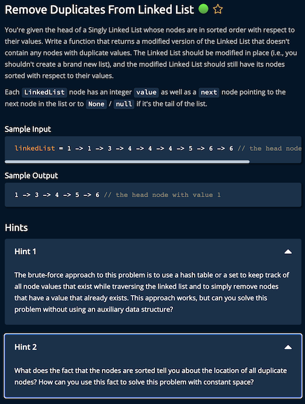

# Linked List Algorithm

## Theory
Please read [Linked List Algorithm Theory](https://github.com/gitmehedi/algoExpert/tree/master#linked-lists) for there

## Algorithm

## 1. Remove Duplicates From Linked List
**Problem**  

**Solution:**  
[Solution Here.....](./1_Remove_Duplicates_From_Linked_List.py)
## 2. Middle Node
## 3. Linked List Construction
## 4. Remove Kth Node From End
## 5. Sum of Linked Lists
## 6. Merging Linked Lists
## 7. Find Loop
## 8. Reverse Linked List
## 9. Merge Linked Lists
## 10. Shift Linked List
## 11. LRU Cache
## 12. Rearrange Linked List
## 13. Linked List Palindrome
## 14. Zip Linked List
## 15. Node Swap